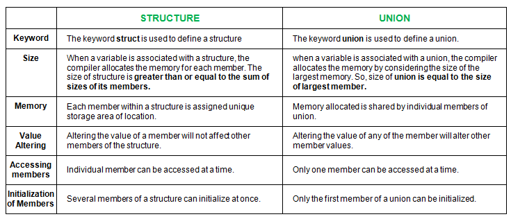

# Structure
In C programming, a structure is a user-defined data type that allows the grouping of variables of different types 
under a single name. Structures are useful when you need to store information about different properties of an 
entity that may vary in type (such as integers, floats, and characters).

Syntax of Structure in C
```
struct structure_name {
    data_type1 variable1;
    data_type2 variable2;
    ...
};
struct: Keyword used to define the structure.
structure_name: The name of the structure.
data_type: Any valid C data type (e.g., int, float, char).
variable: Variable names of different types within the structure.
```

Example:
Let’s consider a scenario where we want to store information about a student. 
The information includes the student’s ID, name, and marks.

```
#include <stdio.h>

// Define a structure named Student
struct Student {
    int id;
    char name[50];
    float marks;
};

int main() {
    // Declare a structure variable
    struct Student student1;

    // Assign values to the structure members
    student1.id = 101;
    strcpy(student1.name, "John Doe"); // Copy string into name
    student1.marks = 89.5;

    // Display the structure values
    printf("Student ID: %d\n", student1.id);
    printf("Student Name: %s\n", student1.name);
    printf("Student Marks: %.2f\n", student1.marks);

    return 0;
}
```

## Structure Definition:

```
struct Student {
    int id;
    char name[50];
    float marks;
};
This defines a structure Student with three members:

id: Stores the student's ID (an integer).
name: Stores the student's name (a string of characters).
marks: Stores the student's marks (a floating-point number).
```
## Structure Declaration:

```
struct Student student1;
Declares a variable student1 of type struct Student.
```

## Accessing Members:

Use the dot operator (.) to access structure members, such as `student1.id, student1.name, and student1.marks`.

## Assigning Values:

- `student1.id = 101; assigns 101 to the id field.`
- `student1.marks = 89.5; assigns 89.5 to the marks field.`

## Benefits of Structures
- Organization: Structures allow you to group related data together.
- Flexibility: You can have different data types within a single structure.
- Reusability: Once defined, the structure can be used to declare multiple variables of the same type.

# Structure vs union


